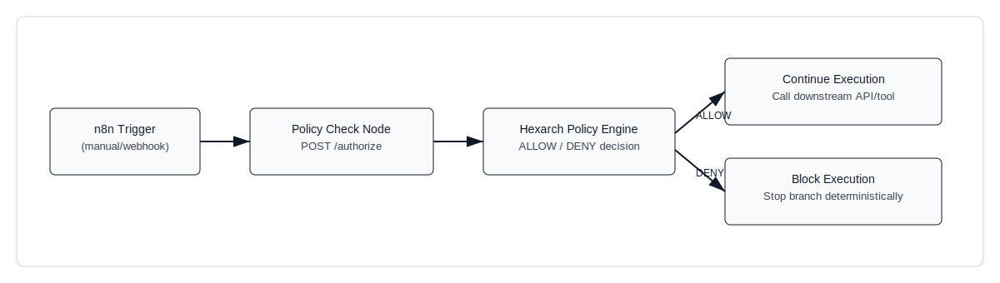

# Adding Pre-Execution Policy Enforcement to n8n in 15 Minutes

## Problem

Automation workflows can fail into cost and stability incidents before operators can intervene. In n8n, a loop or retry branch can trigger unbounded API calls, and agent-like chains can recursively expand execution depth. Traditional controls such as billing alerts, post-run logs, and dashboard monitoring are reactive: they detect impact after requests are sent. The engineering goal here is deterministic prevention at the decision point, before external calls execute.

## Architecture Pattern

Hexarch Guardrails is evaluated before the external call path. The workflow asks Guardrails for an allow/deny decision, then continues only on allow.



Flow:

1. n8n trigger receives or creates execution input.
2. n8n sends policy context to `POST /authorize`.
3. Guardrails evaluates policy rules and returns ALLOW or DENY.
4. n8n continues controlled execution only when allowed.
5. n8n blocks downstream calls deterministically on deny.

## Minimal Demonstration

This repository includes an importable workflow:

- `n8n/workflows/hexarch-pre-execution-threshold-guard.json`

The workflow uses a manual trigger and sends `request_count` in `context` to Guardrails. The default demo values are `requestCount=7`, `threshold=5`, so the first run blocks by design.

### Step 1: Create a threshold rule

```http
POST /rules
Authorization: Bearer dev-token
X-Actor-Id: admin
Content-Type: application/json

{
  "name": "n8n-request-count-threshold",
  "rule_type": "CONSTRAINT",
  "description": "Deny when request count exceeds threshold",
  "priority": 10,
  "enabled": true,
  "condition": {
    "field": "input.context.request_count",
    "op": "lte",
    "value": 5
  }
}
```

### Step 2: Attach rule to a policy

```http
POST /policies
Authorization: Bearer dev-token
X-Actor-Id: admin
Content-Type: application/json

{
  "name": "n8n-pre-execution-threshold",
  "description": "Block provider call when request count is over 5",
  "enabled": true,
  "scope": "GLOBAL",
  "scope_value": null,
  "failure_mode": "FAIL_CLOSED",
  "rule_ids": ["<RULE_ID_FROM_STEP_1>"]
}
```

### Step 3: Authorization payload sent by n8n

```json
{
  "action": "call_provider",
  "resource": { "name": "external-api" },
  "context": {
    "provider_action": "invoke",
    "request_count": 7,
    "threshold": 5
  }
}
```

### Example rejection response

```json
{
  "allowed": false,
  "decision": "DENY",
  "reason": "policy_denied:bc57117f-98ee-4d47-bc4c-cd6fd2cfb2bd",
  "policies": ["bc57117f-98ee-4d47-bc4c-cd6fd2cfb2bd"]
}
```

## Before / After Behavior

### Without Guardrails pre-check

Downstream call executes directly; repeated loop iterations keep returning success until another system intervenes.

```http
POST /echo
200 OK
{
  "ok": true,
  "message": "loop-step",
  "metadata": { "iteration": 7 }
}
```

### With Guardrails pre-check

Authorization is evaluated first. At `request_count=3`, execution is allowed. At `request_count=7`, execution is blocked before downstream call.

```http
POST /authorize (request_count=3)
200 OK
{
  "allowed": true,
  "decision": "ALLOW",
  "reason": null,
  "policies": ["bc57117f-98ee-4d47-bc4c-cd6fd2cfb2bd"]
}
```

```http
POST /authorize (request_count=7)
200 OK
{
  "allowed": false,
  "decision": "DENY",
  "reason": "policy_denied:bc57117f-98ee-4d47-bc4c-cd6fd2cfb2bd",
  "policies": ["bc57117f-98ee-4d47-bc4c-cd6fd2cfb2bd"]
}
```

## Engineering Note

This pattern enforces policy before side effects. It differs from try/catch because it prevents calls rather than handling failures after execution starts. It differs from post-execution rate limiting because no external request is sent on deny. It differs from billing alerts because it is a synchronous gate in the execution path, not a delayed signal.
