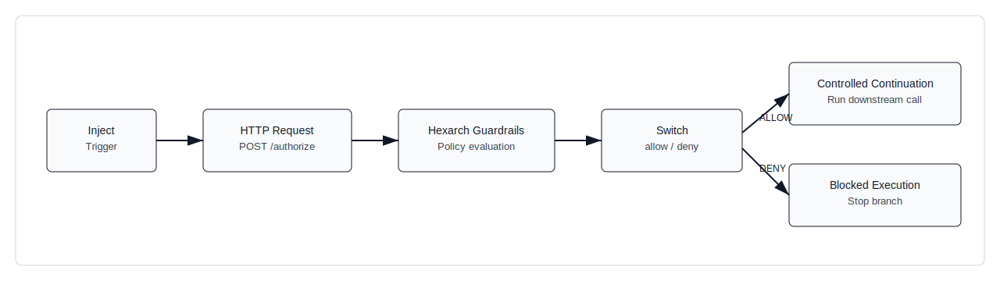

# Adding Pre-Execution Policy Enforcement to Node-RED in 15 Minutes

## Problem

Automation flows can create external-call amplification before operators can react. In Node-RED, loop/retry branches may emit repeated API calls, and agent-like flow compositions can expand execution recursively. Controls such as billing alerts, log review, and dashboards are post-factum: they identify impact after requests are already sent. A pre-execution policy gate is intended to prevent side effects by evaluating allow/deny before the downstream call node runs.

## Architecture Pattern

Node-RED sends a policy-check request to Hexarch Guardrails before invoking a target API. Flow continuation is routed by explicit allow/deny output.



Pattern:

1. `Inject` node triggers the flow.
2. `HTTP Request` posts policy context to `POST /authorize`.
3. Guardrails returns `ALLOW` or `DENY`.
4. `Switch` routes to controlled continuation on allow.
5. `Switch` routes to blocked path on deny.

## Minimal Demonstration

Import this flow:

- `node-red/flows/hexarch-pre-execution-threshold-guard.json`

Default values in the flow set `request_count=7` against a policy threshold of `5`, so deny behavior is immediately observable.

### Step 1: Create threshold rule

```http
POST /rules
Authorization: Bearer dev-token
X-Actor-Id: admin
Content-Type: application/json

{
  "name": "node-red-request-count-threshold",
  "rule_type": "CONSTRAINT",
  "description": "Deny when request count exceeds threshold",
  "priority": 10,
  "enabled": true,
  "condition": {
    "field": "input.context.request_count",
    "op": "lte",
    "value": 5
  }
}
```

### Step 2: Create policy bound to rule

```http
POST /policies
Authorization: Bearer dev-token
X-Actor-Id: admin
Content-Type: application/json

{
  "name": "node-red-pre-execution-threshold",
  "description": "Block provider call when request count is over 5",
  "enabled": true,
  "scope": "GLOBAL",
  "scope_value": null,
  "failure_mode": "FAIL_CLOSED",
  "rule_ids": ["7e4a29d6-9a7a-49f0-8116-f396584c4aed"]
}
```

### Step 3: Authorization payload from Node-RED

```json
{
  "action": "call_provider",
  "resource": { "name": "external-api" },
  "context": {
    "provider_action": "invoke",
    "request_count": 7,
    "threshold": 5
  }
}
```

### Example rejection response

```json
{
  "allowed": false,
  "decision": "DENY",
  "reason": "policy_denied:166e713c-b2fd-4325-8522-3ff3022632bb",
  "policies": ["166e713c-b2fd-4325-8522-3ff3022632bb"]
}
```

## Before / After Behavior

### Without pre-execution Guardrails check

The downstream call executes directly and can continue across loop iterations.

```http
POST /echo
200 OK
{
  "ok": true,
  "message": "loop-step",
  "metadata": { "iteration": 7 }
}
```

### With pre-execution Guardrails check

`request_count=3` is allowed; `request_count=7` is denied before downstream execution.

```http
POST /authorize (request_count=3)
200 OK
{
  "allowed": true,
  "decision": "ALLOW",
  "reason": null,
  "policies": ["166e713c-b2fd-4325-8522-3ff3022632bb"]
}
```

```http
POST /authorize (request_count=7)
200 OK
{
  "allowed": false,
  "decision": "DENY",
  "reason": "policy_denied:166e713c-b2fd-4325-8522-3ff3022632bb",
  "policies": ["166e713c-b2fd-4325-8522-3ff3022632bb"]
}
```

## Technical Comparison

This design is a pre-side-effect gate, not exception handling. `try/catch` runs after execution has started. Post-execution rate limiting and billing alerts are reactive controls. Policy evaluation at `POST /authorize` enforces deterministic branch control before any downstream API call node runs.
